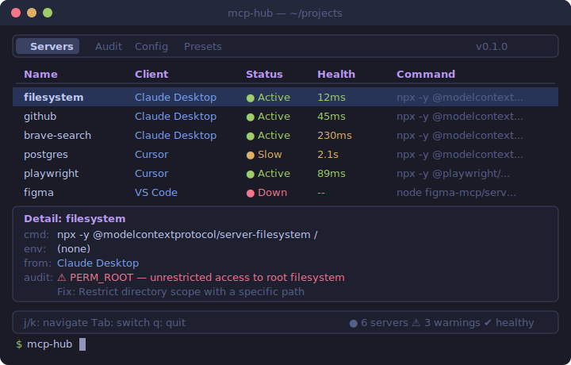

<div align="center">

# mcp-hub

**One TUI to manage all your MCP servers.**

[](LICENSE)
[](https://www.rust-lang.org/)

You installed MCP servers in Claude Desktop, Cursor, VS Code, and Claude Code.
They're scattered across different config files.
Some are broken. Some have security issues. You can't see them all at once.

**mcp-hub fixes that.** One terminal dashboard. All your servers. 15 security rules. Zero dependencies.



</div>

---

## What it does

| Feature | Description |
|---------|-------------|
| **TUI Dashboard** | Interactive terminal UI — browse, inspect, and filter all MCP servers |
| **Auto-Discovery** | Scans Claude Desktop, Claude Code, Cursor, Windsurf configs automatically |
| **Security Audit** | **15 rules** — typosquatting, CVE detection, postinstall scripts, shell injection, secrets, and more |
| **Health Checks** | Shows which servers are running and which are down |
| **Single Binary** | One Rust binary. No runtime. No dependencies. `cargo install` and go. |

## Install

```bash
# From GitHub (requires Rust)
cargo install --git https://github.com/jiale-cheng-ning/mcp-hub

# Or clone and build
git clone https://github.com/jiale-cheng-ning/mcp-hub.git
cd mcp-hub
cargo build --release
# binary: target/release/mcp-hub
```

## Usage

```bash
mcp-hub              # Launch TUI dashboard
mcp-hub scan         # List all servers in a table
mcp-hub scan --json  # JSON output for scripting
mcp-hub audit        # Run security audit
mcp-hub audit --json # JSON output for CI pipelines
```

### TUI keybindings

**Servers tab:**

| Key | Action |
|-----|--------|
| `j` / `↓` | Move down |
| `k` / `↑` | Move up |
| `Tab` | Switch to Audit tab |
| `q` / `Esc` | Quit |

**Audit tab:**

| Key | Action |
|-----|--------|
| `j` / `↓` | Next finding |
| `k` / `↑` | Previous finding |
| `1` | Toggle Critical severity |
| `2` | Toggle Warning severity |
| `3` | Toggle Info severity |
| `g` | Jump to first finding |
| `G` | Jump to last finding |
| `Tab` | Switch to Servers tab |
| `q` / `Esc` | Quit |

## Audit rules (15)

### Critical

| Rule | What it catches |
|------|-----------------|
| `TYPOSQUATTING` | Package name suspiciously similar to a known MCP server (e.g., `postgress` vs `postgres`) |
| `POSTINSTALL_SCRIPT` | npm package may run postinstall/preinstall scripts during installation |
| `KNOWN_CVE` | Package matches a known CVE (e.g., CVE-2025-6514 in mcp-remote) |
| `DANGEROUS_COMMAND` | Server args contain `curl\|bash`, `rm -rf`, `eval`, or other dangerous patterns |
| `WORLD_READABLE_SECRET` | Config file containing secrets has overly permissive file permissions |

### Warning

| Rule | What it catches |
|------|-----------------|
| `ENV_PLAINTEXT_SECRET` | API keys / tokens stored as plaintext in config |
| `PERM_ROOT` / `PERM_HOME` | Filesystem servers with unrestricted access |
| `DEPRECATED_SERVER` | Using a deprecated MCP server or package |
| `SHELL_INJECTION` | Args contain `$()`, backticks, `&&`, `|` — potential shell injection |

### Info

| Rule | What it catches |
|------|-----------------|
| `NO_VERSION_PIN` | npm packages without pinned versions |
| `LATEST_VERSION` | Pinned version is 0.x — may be outdated or unstable |
| `DUPLICATE_SERVER` | Same server configured in multiple clients |
| `CONFIG_FILE_PERMS` | Config file permissions are not restricted to owner-only |
| `LICENSE_RISK` | Package uses a copyleft license (AGPL/GPL) |

### Example: `mcp-hub audit`

```
🔴 CRITICAL (1)
  ├─ pg: Package '@modelcontextprotocol/server-postgress' looks like a typosquat of '@modelcontextprotocol/server-postgres'
  │  Fix: Verify this is the intended package. Did you mean '@modelcontextprotocol/server-postgres'?

🟡 WARNING (2)
  ├─ filesystem: Server 'filesystem' has unrestricted access to root filesystem
  │  Fix: Restrict directory scope with a specific path
  ├─ github: Potential secret 'GITHUB_PERSONAL_ACCESS_TOKEN' stored in plaintext config
  │  Fix: Use environment variable reference or secret manager

ℹ️  INFO (2)
  ├─ filesystem: Unpinned package version: '@modelcontextprotocol/server-filesystem'
  │  Fix: Pin to a specific version (e.g., @scope/pkg@1.2.0)
  ├─ github: Server 'github' duplicates 'github-cursor' (same command in Claude Desktop and Cursor)
  │  Fix: Consider using a shared configuration or removing the duplicate

Total findings: 5
```

## Supported clients

| Client | Config location |
|--------|----------------|
| Claude Desktop | `%APPDATA%\Claude\claude_desktop_config.json` |
| Claude Code | `~/.claude/settings.json` |
| Cursor | `~/.cursor/mcp.json` |
| Windsurf | `~/.codeium/windsurf/mcp_config.json` |

## Roadmap

- [x] Auto-discovery of MCP configs across 4 clients
- [x] TUI dashboard with server list and detail panel
- [x] Security audit with 15 rules (typosquatting, CVE, shell injection, secrets, ...)
- [x] Health checks (process detection)
- [x] Severity-based filtering in TUI
- [x] JSON output for CI integration
- [ ] Config sync between clients
- [ ] Export/import configurations (Git-friendly)
- [ ] Real MCP protocol health checks (connect and validate)
- [ ] Server performance benchmarks
- [ ] MCP Registry search and one-click install
- [ ] Preset server bundles (`mcp-hub preset install web-dev`)
- [ ] Real-time log viewer
- [ ] Resource monitoring (CPU/memory)

## Contributing

Contributions welcome. Open an issue first to discuss what you'd like to change.

## License

MIT — see [LICENSE](LICENSE).
